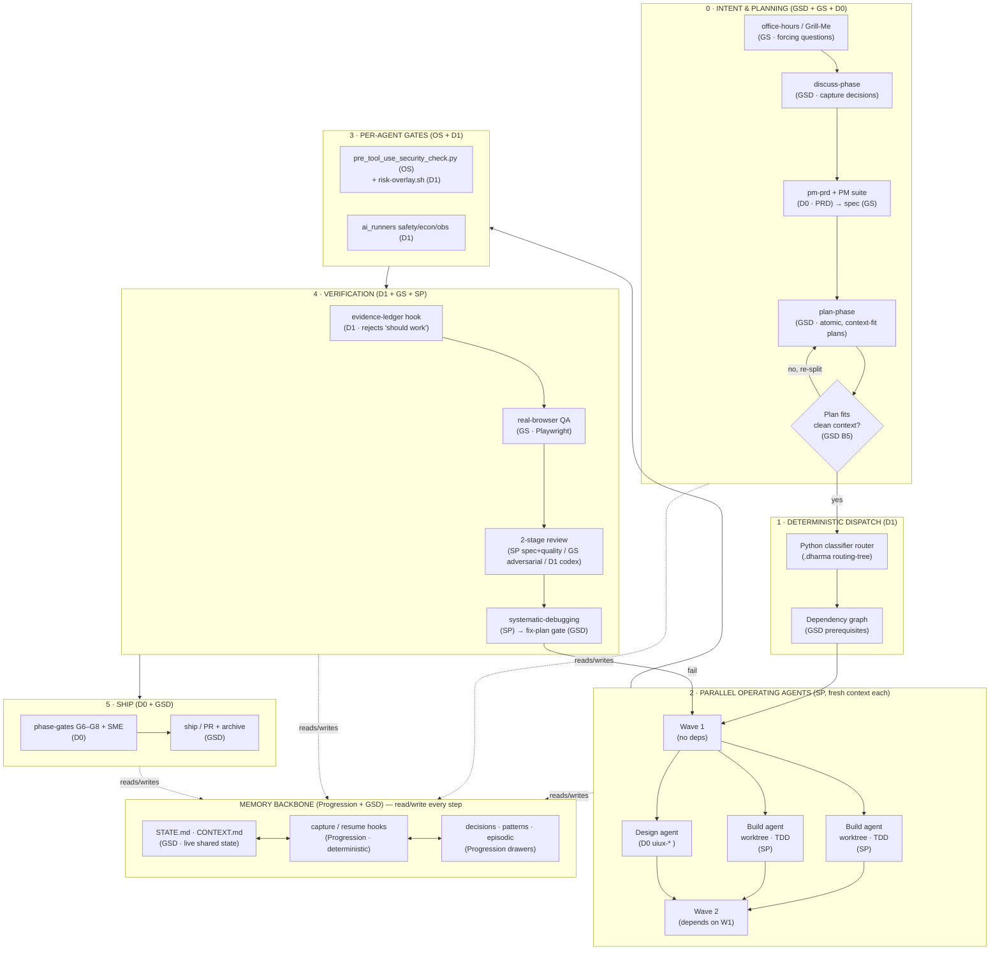

# Dharma3 — Build Plan & Architecture

> **Companion to** `DHARMA3_COMPARISON.md` (the scored decision record).
> This file maps every layer-owner to **concrete files/skills to port**, defines the
> **orchestrator ↔ operating-agent architecture**, and gives a **port order**.

**Tagline:** *Direct many agents. Ship with evidence. Remember everything.*

**Lineage:** Dharma 0.x (governance + design, instructions) → Dharma 1 (discipline as machinery) →
**Dharma3** (multi-agent: orchestrator + dependency-aware parallel operating-agents + complete memory).

---

## 1. Architecture — orchestrator + operating agents + dependency/STATE flow



**Reading the diagram:** intent/PRD/plan are produced once (lean main session), the plan is
**verified to fit a clean context**, then a **deterministic router** turns it into a **dependency
graph**. Independent tasks run as **parallel operating agents in fresh, worktree-isolated contexts**;
dependent waves wait on their prerequisites. Every agent passes a **security/risk gate**, every wave
must clear **evidence + real-browser + review + debug** before the next wave depends on it. **STATE.md
+ Progression memory** is the shared spine read and written at every step — the thing none of the six
source frameworks had.

---

## 2. Layer-owner → concrete port mapping

> Paths are where the source lives today. "Port" = copy + rename into Dharma3's skill/hook layout.

### A · Orchestration  (owner: GSD-core; co: SP, D1, OS)

| Component | Port from | Concrete file/skill |
|---|---|---|
| Orchestrator loop | GSD | `Skills Library/GSD/.agent/skills/gsd-new-project.md`, `gsd-help.md` |
| Parallel waves + deps | GSD | `gsd-execute-phase.md` (prerequisite checks, task ordering) |
| Plan/discuss phases | GSD | `gsd-plan-phase.md`, `gsd-discuss-phase.md` |
| Subagent dispatch + review | SP | `obra/superpowers` → `skills/dispatching-parallel-agents`, `subagent-driven-development` |
| Worktree isolation | SP | `skills/using-git-worktrees`, `finishing-a-development-branch` |
| Deterministic dispatch | D1 | `Skills Library/Gstack/scripts/` router + `.dharma/routing-tree.md`, `config.yaml` |
| Handoff (machine + human) | GSD + OS | GSD `STATE.md`/`CONTEXT.md` schema + OS `06-handoffs/HANDOFF_REPORT_TEMPLATE.md` |

### B · Planning  (owner: GSD-core; co: GS, D1, D0, OS)

| Component | Port from | Concrete file/skill |
|---|---|---|
| Intent / forcing questions | GS | `garrytan/gstack` → `office-hours/` ; SP `skills/brainstorming` |
| Scope control | D1 | `Skills Library/Gstack/skills/p1-plan/plan-ceo/` |
| Atomic, context-fit plans | GSD + SP | GSD `gsd-plan-phase.md` + SP `skills/writing-plans` |
| Plan-fits-context verify | GSD | `gsd-plan-phase.md` (the context-fit check) |
| PRD | D0 + OS + GS | D0 `Dharma/pm-prd/` (+ `pm-job-stories`, `pm-user-stories`, `pm-prioritization`) + OS `02-plans/PRD_TEMPLATE.md` + GS `spec` |

### C · Execution  (owner: Superpowers; co: GSD, D1, D0)

| Component | Port from | Concrete file/skill |
|---|---|---|
| No-scope-creep mandate | GSD + D1 | GSD `gsd-execute-phase.md` role block + D1 `skills/p3-build/karpathy-check/` |
| TDD | SP | `skills/test-driven-development` |
| Surgical change | D0 | `Dharma/surgical-changes/` |
| Checkpoint + iterate | GSD + SP | GSD per-task STATE update + SP `skills/executing-plans` |

### D · Verification  (owner: Gstack; co: D1, SP, GSD)

| Component | Port from | Concrete file/skill |
|---|---|---|
| Evidence enforcement | D1 | `Skills Library/Gstack/hooks/evidence-ledger.sh` + `skills/p4-verify/evidence/` |
| Real-browser harness | GS | `gstack` → `qa/` (Playwright/Agent-Browser) |
| 2-stage / adversarial review | SP + GS + D1 | SP `skills/requesting-code-review` + `receiving-code-review`; GS `review/`; D1 `skills/p4-verify/codex/` |
| Systematic debugging | SP | `skills/systematic-debugging` |
| Verification-before-completion | SP | `skills/verification-before-completion` |
| Canary / benchmark | GS | `gstack` → `canary/`, `benchmark/` |

### E · Governance  (owner: Dharma 1; co: OS, GS, D0)

| Component | Port from | Concrete file/skill |
|---|---|---|
| Security pre-tool gate | OS + D1 | OS `.claude/hooks/pre_tool_use_security_check.py` wrapped in D1 `hooks/risk-overlay.sh` |
| Risk gating | D1 + GS | D1 `skills/p5-ship/risk-gate/` + GS `freeze/`, `guard/` |
| AI safety/econ/observability | D1 | `Skills Library/Gstack/ai_runners/*.py` (+ `tests/`, `evals/`) |
| Phase gates + SME | D0 | `Dharma/00-lifecycle-orchestrator/{phase-gates.md, sme-review-gate.md, lead-agent-evaluation.md, evidence-contract.md}` |
| Human approval | GSD + D0 | GSD `gsd-discuss-phase.md` + D0 phase-gate at ship |

### F · Memory  (owner: Progression; co: GSD, GS)

| Component | Port from | Concrete file/skill |
|---|---|---|
| Capture / resume hooks | PROG | `~/.progression-memory/bin/mem_capture.py`, `mem_load.py` + `settings.hooks.json` |
| Live shared state | GSD | `STATE.md` + `CONTEXT.md` schema (read/write by every wave) |
| Decisions / patterns / episodic | PROG | `.agent/{DECISIONS.md, progression.md, sessions/}` drawers |

### G · Design  (owner: Dharma 0.x; co: GS)

| Component | Port from | Concrete file/skill |
|---|---|---|
| UI/UX depth | D0 | `Dharma/uiux-{designer,accessibility-review,responsive-review,interaction-review,design-qa,design-intelligence,frontend-design-system,react-patterns}/` + `frontend-design/` |
| Visual gen + visual-QA | GS | `gstack` → `design-shotgun/`, `design-review/` |

### H · Platform / Harness  (owner: Superpowers; co: D1, OS, GSD, GS)

| Component | Port from | Concrete file/skill |
|---|---|---|
| Hooks / enforcement | D1 + OS | D1 `hooks/*.sh` + OS `.claude/hooks/*.py` (event-driven pattern from SP/GS) |
| Skills composability | SP | `obra/superpowers` skill-chaining model + `skills/using-superpowers`, `writing-skills` |
| Install / portability | D1 + GSD | D1 `install.sh` (60s zero-dep) + GSD `npx get-shit-done-cc` multi-runtime packaging |

---

## 3. Proposed Dharma3 repo layout

```
ProductDevFramework/
├── DHARMA3_COMPARISON.md          # decision record (scoring)
├── DHARMA3_BUILD_PLAN.md          # this file
├── README.md                      # framework identity + quickstart
├── .dharma/
│   ├── config.yaml                # from D1
│   └── routing-tree.md            # from D1
├── orchestrator/                  # GSD loop: discuss/plan/execute/verify/ship
├── agents/                        # operating-agent contracts (SP-style, fresh-context)
│   ├── build-agent/               # SP TDD + worktree
│   ├── design-agent/              # D0 uiux-*
│   └── qa-agent/                  # GS real-browser
├── skills/                        # ported skills, by layer (A–H)
├── hooks/                         # evidence-ledger.sh, risk-overlay.sh, pre_tool_security.py, mem_capture.py
├── ai_runners/                    # D1 Python governance (safety/econ/obs + tests)
├── memory/                        # Progression backbone + STATE.md/CONTEXT.md schema
├── templates/                     # PRD, handoff, release, incident (OS)
└── scripts/                       # router classifier, install.sh
```

---

## 4. Port order (phased build)

| Phase | Goal | Port | Exit evidence |
|:--:|---|---|---|
| **P0** | Memory + STATE spine | PROG hooks + GSD STATE.md/CONTEXT.md schema | A fresh session resumes from STATE.md deterministically |
| **P1** | Orchestrator loop | GSD discuss/plan/execute/verify/ship + plan-fits-context check | One feature runs end-to-end single-agent |
| **P2** | Deterministic dispatch + dependency graph | D1 router + GSD prerequisites | Router emits a dependency-ordered wave plan |
| **P3** | Parallel operating agents | SP dispatch + worktrees + TDD | Two independent agents run in parallel, isolated, merge cleanly |
| **P4** | Per-agent gates | OS security hook + D1 risk-overlay + ai_runners | A blocked action is stopped before the tool runs |
| **P5** | Verification harness | D1 evidence hook + GS real-browser + SP 2-stage review/debug | A wave cannot close on "should work"; browser proof required |
| **P6** | Specialist agents | D0 uiux-* + pm-prd + GS design-shotgun | A user-facing feature ships with a11y + visual-QA evidence |
| **P7** | Phase gates + ship | D0 G6–G8/SME + GSD ship/PR | Human approval gate + release with rollback path |

**Principle (inherited from Dharma 1):** every phase exits only on *evidence*, never on belief.
Each bug found during a port becomes a permanent rule/hook/skill — the system compounds.

---

## 5. Open decisions for revisit

- Runtime packaging: zero-dep Python (D1) vs npm multi-runtime (GSD) — or both, layered.
- Whether the Gstack QA harness is ported or shelled out to (TS/Bun dependency cost).
- Progression vs GBrain for the long-term decision store (currently Progression, zero-dep).
- Candidate frameworks to score next: OpenClaude, Hermes, Archon, standalone Conductor.
