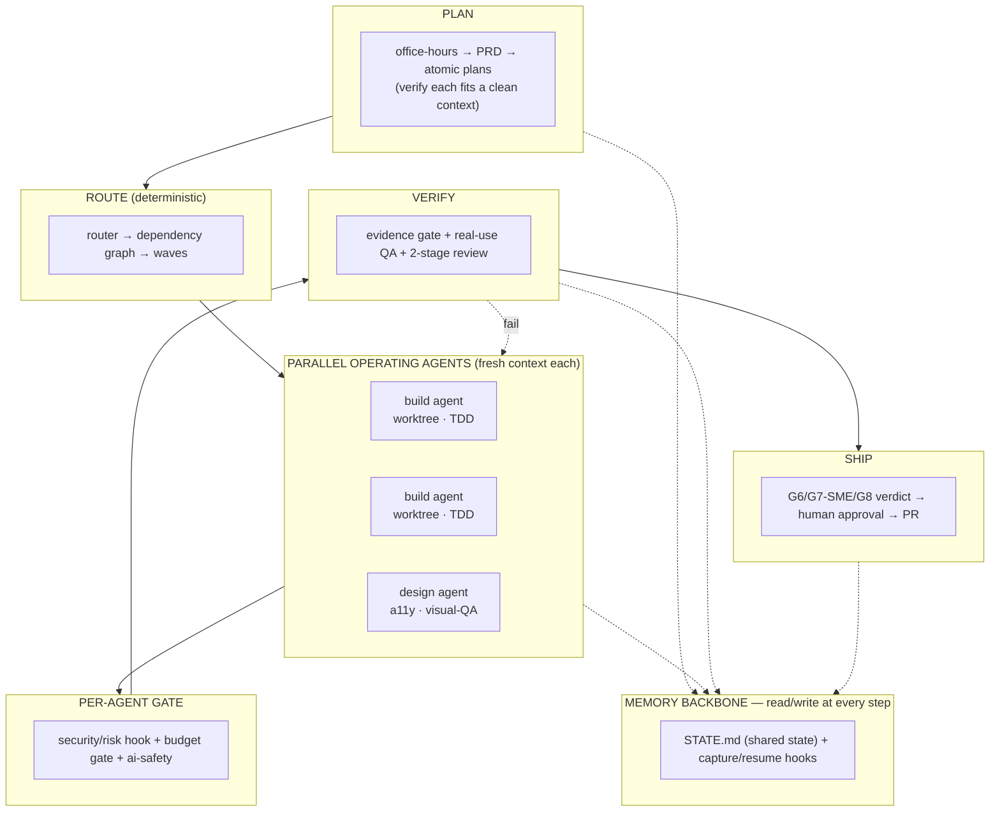

# Dharma3

> **Direct many agents · Ship with evidence · Remember everything.**

[](#status--roadmap)
[](#verification)
[](#install)
[](#license)

A **multi-agent product-development framework** for Claude Code. A lean **orchestrator** plans the
work, a **deterministic router** breaks it into dependency-ordered waves, and **operating agents**
run those waves in parallel — each in an isolated worktree with a fresh context — gated by security
and budget, verified with evidence, and persisted to a memory backbone that survives sessions.

It is the synthesis of six frameworks: each layer is owned by whichever framework does it best,
chosen by a [component-by-component scored comparison](DHARMA3_COMPARISON.md).

**Lineage:** [Dharma 0.x](https://github.com/SahuDilip1356/Dharma) (governance + design discipline)
→ [dharma-1](https://github.com/SahuDilip1356/dharma-1) (discipline as machinery)
→ **Dharma3** (the multi-agent leap).

---

## Table of contents
- [Why Dharma3](#why-dharma3)
- [The core loop](#the-core-loop)
- [Architecture](#architecture)
- [Install](#install)
- [Invoke](#invoke)
- [What fires automatically](#what-fires-automatically-machinery-not-instructions)
- [How it was assembled](#how-it-was-assembled)
- [Repo structure](#repo-structure)
- [Verification](#verification)
- [Status & roadmap](#status--roadmap)
- [Lineage & acknowledgments](#lineage--acknowledgments)
- [License](#license)

---

## Why Dharma3

AI coding agents are fast but undisciplined by default. Hand one a big task and it hits the
context "dumb zone," skips verification, claims done on belief, and forgets everything next session.
The fixes already exist — but scattered across different frameworks:

- **GSD-core** nails the orchestrator + parallel fresh-context waves, but is light on governance.
- **Superpowers** nails subagent dispatch, worktrees, and TDD, but has no design/PRD layer.
- **Gstack** nails empirical QA and real-browser checks, but is velocity-first on discipline.
- **Dharma 1** nails deterministic routing + AI-governance-as-code, but is thin on orchestration.
- **Dharma 0.x** nails PRD/PM and accessibility/design depth, but is instructions, not machinery.
- **Claude Product Dev OS** has a clean pre-tool security hook and templates.

Dharma3 takes **the winning component from each** and wires them into one loop — zero-dependency
Python you own, no framework lock-in.

## The core loop

```
new → plan → route → execute(parallel) → govern → verify → ship → (evolve)
```

| Phase | What happens | Owner framework |
|---|---|---|
| **Plan** | Forcing questions → PRD → roadmap → atomic, context-fit task plans | GSD · Gstack · Dharma 0.x |
| **Route** | Deterministic dependency graph → ordered parallel waves | Dharma 1 |
| **Execute** | One isolated sub-agent per task (worktree, fresh context, TDD) | Superpowers · GSD |
| **Govern** | Budget gate + AI-safety/economics/observability + security/risk hooks | Dharma 1 · OS |
| **Verify** | Evidence gate (no "should work") + real-use QA + 2-stage review | Dharma 1 · Gstack · SP |
| **Ship** | G6/G7-SME/G8 verdict → human approval → PR with rollback | Dharma 0.x · GSD |
| **Evolve** | Every bug becomes a permanent rule/hook/skill/test | Dharma doctrine |

**Two principles run through all of it:** *no completion claim without evidence*, and *capture is
machinery, not instruction* — continuity never depends on the model remembering.

## Architecture



The orchestrator stays lean; heavy work is delegated to focused sub-agents that only ever see their
own brief. The dependency graph decides who can run together; worktrees let them run isolated and
merge clean; STATE.md is the shared spine every agent reads and writes.

## Install

Requires only **`python3` + `git`** (zero third-party packages).

```bash
git clone https://github.com/SahuDilip1356/Dharma3.git
cd Dharma3
./install.sh                 # install into this project
./install.sh /path/to/app    # …or into another project
# then restart Claude Code so the hooks load
```

The installer wires the Claude Code hooks (`settings.json`), activates the git hooks (evidence-ledger
on commit, risk-overlay on push) if the target is a git repo, seeds `memory/STATE.md`, and verifies
every gate runs.

## Invoke

In Claude Code, type:

```text
/dharma3 new "<intent>"     Plan: forcing questions → PRD → roadmap
/dharma3 plan <phase>       Atomic, context-fit task plans (with router frontmatter)
/dharma3 route <phase>      Deterministic dependency graph → ordered waves
/dharma3 execute <phase>    Run the waves (single-agent or parallel sub-agents)
/dharma3 verify <phase>     Evidence gate + real-use QA + 2-stage review
/dharma3 ship <phase>       G6/G7-SME/G8 verdict → human approval → PR
/dharma3 govern <gate|report>  Budget gate / cost+drift report
/dharma3 status             Read STATE.md, show progress
/dharma3 help               Menu
```

For `/dharma3` to work in every project, copy the skill to your user config:
`cp -R .claude/skills/dharma3 ~/.claude/skills/`.

## What fires automatically (machinery, not instructions)

You never invoke these — hooks do:

- **Memory** — `SessionStart` loads `memory/STATE.md`; `SessionEnd`/`PreCompact` capture a digest.
- **Security** — `PreToolUse` blocks destructive / secret-touching actions *before* they run
  (`rm -rf`, force-push, `DROP TABLE`, `.env` access, …).
- **Evidence** — the `commit-msg` git hook rejects banned phrases (`should work`, `probably passes`)
  and requires one of five explicit completion states.
- **Risk** — the `pre-push` git hook blocks pushes to high-risk paths (auth/payments/migrations/llm)
  without verification receipts.

## How it was assembled

Dharma3 is not opinion — it is the result of scoring **6 frameworks across 40 components**,
normalizing per layer, weighting by relevance to a multi-agent build, and taking each component's
winner. Full method, scores, and the bill of materials are in
**[DHARMA3_COMPARISON.md](DHARMA3_COMPARISON.md)**; the port mapping and phase plan are in
**[DHARMA3_BUILD_PLAN.md](DHARMA3_BUILD_PLAN.md)**.

| Layer | Owner(s) |
|---|---|
| Orchestration + planning | GSD-core |
| Operating agents + composability | Superpowers |
| Empirical QA + visual QA | Gstack |
| Governance (router, hooks, AI-safety-as-code) | Dharma 1 |
| PRD/PM + UI/UX + phase-gates | Dharma 0.x |
| Security hook + templates | Claude Product Dev OS |
| Memory backbone | Progression Memory |

## Repo structure

```
Dharma3/
├── .claude/
│   ├── settings.json              # wires SessionStart/End + PreToolUse hooks
│   ├── hooks/                     # 3 python (memory + security) + 2 git (.sh)
│   └── skills/dharma3/
│       ├── SKILL.md               # the orchestrator entry
│       ├── phase-*.md             # plan / execute / verify / ship playbooks
│       ├── state-schema.md        # the STATE.md contract
│       └── agents/                # build · design · pm · qa · research + refs/
├── ai_runners/                    # AI governance as testable Python (38 tests)
├── scripts/                       # router, dispatch, worktree, govern, evidence, ship_gate, evolve
├── memory/STATE.md                # shared working state across agents/sessions
├── templates/PRD_TEMPLATE.md
├── install.sh
├── DHARMA3_COMPARISON.md          # the scored decision record
└── DHARMA3_BUILD_PLAN.md          # architecture + port plan
```

## Verification

- **`ai_runners`** ships **38 governance unit tests** (injection / jailbreak / hallucination / bias
  scorers + economics + observability + overlay) — run `python3 -m unittest discover -s ai_runners/tests -t .`
- The **router** is tested for correct waves, cycle detection, and missing-dependency detection.
- The **evidence-ledger git hook** is verified to block "should work" commits and accept valid
  completion states on live commits.
- The **ship gate** is verified across all verdicts (NO-GO / CONDITIONAL / HOLD / GO).

## Status & roadmap

All seven build phases are complete and verified:

- ✅ **P0** Memory + security hooks (wired in `settings.json`)
- ✅ **P1** `/dharma3` orchestrator + phase playbooks
- ✅ **P2** Deterministic router → dependency waves
- ✅ **P3** Parallel operating agents (worktrees, fresh context, briefs)
- ✅ **P4** Governance runners (budget gate + 38-test safety + observability)
- ✅ **P5** Verification harness (evidence gate + git hook + real-use QA)
- ✅ **P6** Specialist agents (pm + uiux/design-shotgun/prd refs)
- ✅ **P7** Ship gates (G6/G7-SME/G8 verdict) + system-evolution capture

**Known limitations (honest):**
- Components are verified unit-by-unit; the full orchestrator→sub-agent→merge→ship flow is best
  proven on a real `/dharma3 new` run.
- Parallel dispatch is orchestrator-driven via Claude Code sub-agents (the executor playbook
  directs it), not a standalone process runner.
- Model pricing for the newest models in `ai_runners/economics.py` are **estimates** — confirm
  against the current price sheet for an exact budget gate.

## Lineage & acknowledgments

Dharma3 stands on the shoulders of:
- **[gstack](https://github.com/garrytan/gstack)** by Garry Tan — velocity, real-browser QA, deploy loop, scope-review skills.
- **[superpowers](https://github.com/obra/superpowers)** by obra — composable skills, subagent-driven dev, worktrees, TDD, 2-stage review.
- **[gsd-core](https://github.com/open-gsd/gsd-core)** — the orchestrator + parallel fresh-context wave model.
- **[Dharma 0.x](https://github.com/SahuDilip1356/Dharma)** & **[dharma-1](https://github.com/SahuDilip1356/dharma-1)** by Dilip Sahu — the evidence ledger, deterministic routing, AI-governance-as-code, and the design/PRD depth.
- The **Claude Product Development OS** — the pre-tool security hook and template pack.

## License

MIT — see lineage repos for their respective licenses on ported components.

---

*Built by Dilip Sahu. Direct many agents. Ship with evidence. Remember everything.*
